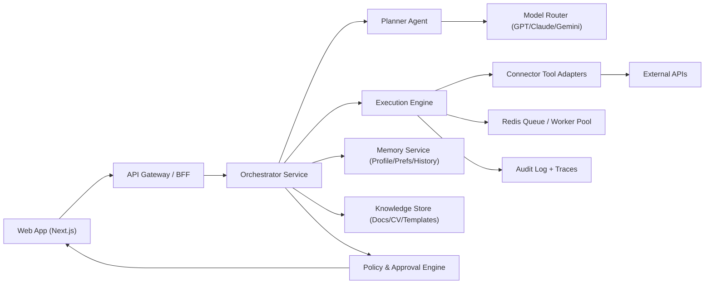

# Autonomous Personal AI Assistant (Hackathon) - Full Technical Documentation

Last updated: February 13, 2026 (US)

## 1) Product Definition

### Vision
Build a permissioned autonomous "Life Operating System" assistant that can execute and coordinate tasks across all major areas of life, with policy-based autonomy:
- Career and education
- Finance and budgeting
- Health and wellness
- Family and relationships
- Travel and mobility
- Home management
- Personal administration
- Communication and content
- Shopping and logistics
- Legal/tax support workflows
- Recreation and lifestyle planning
- Emergency readiness routines

### Non-Negotiable Product Rules
- Human-in-the-loop for high-risk actions (job submit, payments, public posts).
- Explicit user consent per connector and per sensitive action.
- Full audit trail for every action and every model/tool call.
- Reversible actions when possible (draft-first, then approve).
- Bounded autonomy: every automation must run under user-defined policy, limits, and spend caps.
- Plain-language first: all actions, risks, and settings must be understandable by non-technical users.

## 2) Scope: Hackathon MVP vs Universal System

### In-Scope (MVP)
- Unified task inbox and command bar.
- Multi-step orchestration with approvals.
- At least 4 working connectors:
  - Google Calendar (events/reminders)
  - Gmail (draft/send with approval)
  - LinkedIn content draft flow (or social queue API)
  - ATS/job pipeline integration (Greenhouse/Lever data + application drafting)
- CV tailoring and motivation letter generation from stored profile.
- Parallel execution for low-risk tasks.
- Extensible plugin framework proving "any domain can be added quickly."

### Out-of-Scope (Post-hackathon)
- Fully autonomous financial transactions without approval.
- Unsupported private APIs or ToS-violating automation.
- Long-term unsupervised background execution without policy checks.
- Full global regulatory/legal automation without jurisdiction-specific review.

### Universal Target (Post-MVP Vision)
- One assistant surface for every life domain.
- Domain packs (skills + connectors + policy bundles) that can be installed dynamically.
- Continuous planning engine that handles conflicting goals, budgets, and time constraints across domains.
- Proactive execution (not only reactive commands) based on user goals and recurring patterns.

## 3) Universal Use-Case Matrix (All Areas of Life)

### 3.1 Career and Education
- Job search, CV tailoring, cover letters, application tracking, interview prep, salary benchmarking.
- Course planning, certification reminders, study plan generation, deadline tracking.

### 3.2 Finance and Admin
- Bill reminders, subscription audits, budget recaps, invoice drafting, expense categorization.
- Tax document collection workflows and filing checklists (with accountant handoff).

### 3.3 Health and Wellness
- Medication reminders, appointment scheduling, fitness plan adaptation, meal scheduling.
- Health document organization (labs, prescriptions, insurance docs).

### 3.4 Family and Relationships
- Shared calendar coordination, birthday/anniversary workflows, travel/event coordination.
- Child-school activity reminders and document management.

### 3.5 Home and Lifestyle
- Grocery planning, food ordering, repair/maintenance scheduling, smart-home routine triggers.
- Shopping comparison flows (price/availability) with approval before purchase.

### 3.6 Travel and Mobility
- Trip planning, booking preparation packets, visa/checklist generation, itinerary updates.
- Commute optimization and disruption notifications.

### 3.7 Communication and Content
- Email triage, response drafting, social content planning, newsletter workflows.
- Meeting note summarization and action extraction.

### 3.8 Legal and Compliance Support
- Contract summary drafting, renewal alerts, obligations tracker.
- Policy and deadline reminders (non-legal-advice framing).

### 3.9 Emergency and Resilience
- Emergency contact drill workflows, critical doc backup checks, renewal alerts for IDs/insurance.

### 3.10 Entrepreneurship / Creator Work
- CRM follow-ups, proposal drafting, invoice/reminder workflows, content calendar operations.

## 4) High-Level Architecture



## 5) Core Services

### 4.1 Frontend (Next.js)
- Stack: Next.js (App Router), TypeScript, React, Tailwind, shadcn/ui.
- Key views:
  - Command center (`/dashboard`)
  - Active workflows (`/runs/:id`)
  - Approvals queue (`/approvals`)
  - Connectors/OAuth (`/integrations`)
  - Knowledge vault (`/documents`)
  - CV studio (`/career/cv`)
- State:
  - Server state: TanStack Query
  - Client state: Zustand
  - Realtime updates: SSE/WebSocket from orchestration events

### 4.2 Backend API (FastAPI or NestJS)
- Recommended for speed: FastAPI + Pydantic + Uvicorn.
- Responsibilities:
  - Auth/session verification
  - Task intake and normalization
  - Workflow creation and state transitions
  - Tool execution dispatch
  - Approval gate enforcement
  - Webhook ingestion from third-party APIs

### 4.3 Orchestrator
- Components:
  - Intent parser
  - Planner (creates step graph)
  - Executor (runs graph nodes with retries/timeouts)
  - Policy engine (risk scoring + required approvals)
  - Compensation handlers (rollback/cancel where possible)
- Execution model:
  - DAG steps, with parallel branches for independent subtasks.
  - Idempotency keys on every external action.

### 4.4 Worker Layer
- Redis-backed async jobs (RQ/Celery/Arq/BullMQ).
- At-least-once delivery with idempotent tool handlers.
- Dead-letter queue for failed actions requiring intervention.

### 4.5 Data Layer
- PostgreSQL for transactional records.
- Redis for queues, locks, ephemeral context.
- Object storage (S3/R2) for CVs, templates, parsed documents.
- Vector index (pgvector or managed vector DB) for semantic retrieval.

## 6) AI/LLM System Design

### 6.1 Model Roles
- Planner model:
  - Deep reasoning, task decomposition, tool selection.
- Execution model:
  - Fast instruction following, JSON tool calls, extraction.
- Writing model:
  - CV bullet rewriting, motivation letters, social copy variants.
- Verification model:
  - Policy checks, hallucination screening, schema compliance.

### 6.2 Model Router Strategy
- Route by task type + latency budget + risk level:
  - `high_reasoning`: strategic plan/job matching
  - `structured_fast`: extraction/classification/tool args
  - `longform`: letters/posts/CV rewriting
- Fallback chain:
  - Primary provider -> secondary provider -> cached template path

### 6.3 Current Model Options (as of Feb 13, 2026)
- OpenAI API models page lists GPT-5 family (`gpt-5`, `gpt-5-mini`, `gpt-5-nano`, `gpt-5-pro`) and GPT-4.1 models; OpenAI recommends the Responses API for new builds.
- Anthropic pricing/docs list Claude Sonnet 4.5, Opus 4.1, and Haiku 3.5.
- Google docs list Gemini 2.5 Pro and Gemini 2.5 Flash.

Use a provider-agnostic interface:
- `generate_plan()`
- `run_tool_call()`
- `draft_document()`
- `score_risk()`

## 7) Tool/Connector Layer

Each connector is an adapter with:
- OAuth token management
- Strict input schema
- Rate-limit handling
- Safe execution modes (`dry_run`, `draft`, `execute`)

### 6.1 Required Connectors for MVP
- Google Calendar API (event create/update/reminders)
- Gmail API (draft + send on approval)
- Job ATS APIs (Greenhouse/Lever, where permitted)
- Social posting connector (platform API or scheduler API with compliant scopes)

### 6.2 Food Ordering
- Implement as a mock connector for hackathon demo if production API contracts are unavailable.
- Flow:
  - Build order intent
  - Confirm vendor/menu/address/payment method
  - Require final approval before submission

## 8) Security, Privacy, and Compliance

### 7.1 Identity and Access
- OAuth2/OpenID Connect login.
- Per-connector scoped tokens.
- Encrypt tokens at rest (KMS-managed keys).
- RBAC roles: `owner`, `admin`, `viewer`.

### 7.2 Sensitive Action Policy
- Risk tiers:
  - `L0`: read-only tasks (auto-run)
  - `L1`: drafts (auto-run + notify)
  - `L2`: external write without financial/legal impact (approval if public)
  - `L3`: job submit/payment/public post at scale (mandatory approval)

### 7.3 Auditability
- Persist:
  - User intent
  - Planner output
  - Tool call arguments
  - Action result
  - Approval decisions
  - Model/provider/version used

## 9) Data Model (Minimum Schema)

### Tables
- `users`
- `profiles` (skills, work history, preferences, location)
- `integrations` (provider, scopes, encrypted tokens, expiry)
- `documents` (CV versions, letters, templates, metadata)
- `tasks` (user request envelope)
- `workflow_runs` (state machine root)
- `workflow_steps` (node status, retries, result refs)
- `approvals` (required/approved/rejected + actor + timestamp)
- `tool_calls` (normalized external action logs)
- `events` (timeline stream for UI)

### Example Core States
- Workflow: `queued -> planning -> waiting_approval -> executing -> completed|failed|canceled`
- Step: `pending -> running -> blocked -> done|error|skipped`

## 10) API Contract (Representative)

### Task Intake
- `POST /api/tasks`
- Body:
```json
{
  "intent": "Apply to backend engineer jobs in Berlin and tailor my CV",
  "priority": "high",
  "constraints": {
    "salary_min": 90000,
    "locations": ["Berlin", "Remote EU"]
  }
}
```

### Workflow Status
- `GET /api/workflows/{id}`
- Returns run state, step graph, pending approvals, and generated artifacts.

### Approval Decision
- `POST /api/approvals/{id}/decision`
- Body:
```json
{
  "decision": "approve",
  "comment": "Proceed with 3 shortlisted roles only."
}
```

### Draft Artifact Retrieval
- `GET /api/documents/{id}`

## 11) Critical Workflows

### 11.1 Job Application Workflow
1. Parse target role constraints.
2. Pull profile + latest CV.
3. Retrieve openings via ATS/job APIs.
4. Rank roles by fit score.
5. Generate CV variant per role.
6. Generate motivation letter.
7. Present package for user approval.
8. Submit application via connector (or export packet if direct apply unavailable).
9. Log submission and set reminder follow-up.

### 11.2 Social Posting Workflow
1. Collect topic and platform goals.
2. Generate 3 post variants with tone controls.
3. Compliance/style check.
4. User picks variant and schedule.
5. Publish or queue through connector.
6. Capture permalink and engagement check reminder.

### 11.3 Event + Reminder Workflow
1. Parse event details from natural language.
2. Resolve timezone and participants.
3. Create calendar event.
4. Set reminders and optional prep checklist.
5. Send confirmation to inbox/chat.

### 11.4 Finance Admin Workflow (Example)
1. Ingest bills/subscriptions from connectors.
2. Classify recurring vs one-time.
3. Detect anomalies (price increase/duplicate services).
4. Propose actions (cancel, downgrade, renegotiate, pay reminder).
5. Request approval for any external write/payment action.

### 11.5 Health Routine Workflow (Example)
1. Parse goals, constraints, and availability.
2. Build weekly plan (exercise, meals, reminders).
3. Sync to calendar and reminder system.
4. Adapt plan based on completion/feedback.

### 11.6 Home Operations Workflow (Example)
1. Track recurring home tasks (HVAC, insurance renewal, repairs).
2. Monitor due dates and vendor options.
3. Draft booking/purchase recommendations.
4. Execute only after user approval.

## 12) Universal Automation Engine (Critical for "Every Task")

### 12.1 Domain Pack Architecture
Each life domain is a "Domain Pack" containing:
- Intent ontology (what users can ask)
- Planning templates
- Tool adapters
- Risk policy templates
- Evaluation datasets

### 12.2 Generic Task DSL
Represent all tasks with a common schema:
- `goal`
- `constraints`
- `required_data`
- `candidate_tools`
- `risk_level`
- `approval_points`
- `success_criteria`

This allows the same planner/executor to run any domain workflow.

### 12.3 Autonomy Levels
- `A0`: Suggest only
- `A1`: Draft + ask
- `A2`: Auto-execute low-risk, ask on writes
- `A3`: Conditional auto-execution under strict policy windows

### 12.4 Continuous Planning Loop
1. Observe: new tasks, deadlines, context changes.
2. Plan: optimize across time/budget/priority.
3. Execute: run tasks in parallel where safe.
4. Verify: policy check + outcome validation.
5. Learn: update preferences and future plans.

## 13) Frontend UX Blueprint

### Essential Components
- `TaskComposer`: natural language + structured options.
- `RunTimeline`: step-by-step execution with realtime status.
- `ApprovalCard`: before/after diff + decision buttons.
- `ConnectorHub`: OAuth status and scopes.
- `DocumentDiffViewer`: CV old/new comparison.

### UX Rules
- Always surface "what will happen next" before execution.
- Show risk badge on each action.
- Use explicit toggles for `auto-run` vs `ask-first`.
- Prefer plain language over technical terms in all user-facing text.
- Always offer a one-tap "undo/stop" path for active automations.
- Present one primary decision per screen to reduce cognitive load.

### 13.1 Non-Technical User Experience Standard
- Zero-jargon interface:
  - Use labels like "Connect your calendar" instead of "OAuth provider setup".
  - Use "Needs your approval" instead of "L3 risk gate pending."
- Guided setup wizard (5-10 minutes):
  1. Choose goals (jobs, health, finances, home, etc.).
  2. Connect apps with plain permission explanations.
  3. Set comfort level (`ask every time`, `ask for important`, `auto for safe tasks`).
  4. Confirm emergency stop and notification preferences.
- "Done for you" templates:
  - Prebuilt routines such as "Weekly life admin", "Job hunt mode", "Travel mode".
- Explainability card per action:
  - What I will do
  - Why I am doing it
  - What could go wrong
  - How to undo
- Natural language memory:
  - User can say: "Don't post after 8 PM" or "Never apply without my review."
  - System stores this as policy without requiring settings navigation.

### 13.2 Accessibility and Inclusivity Requirements
- WCAG 2.2 AA baseline.
- Keyboard-only complete navigation.
- Large touch targets for mobile (>=44px).
- Dyslexia-friendly reading mode option.
- Reading level target: Grade 6-8 for primary UI copy.
- Multilingual-ready copy architecture (i18n keys, no hardcoded strings).

### 13.3 Trust-Centered UX Patterns
- Preview-first execution:
  - Always show drafts before high-impact actions.
- Confidence indicator:
  - "High confidence" / "Needs your input" instead of percentages by default.
- Progressive disclosure:
  - Show simple summary first, advanced details only on expand.
- Timeline transparency:
  - Live feed of completed, pending, and blocked steps in plain language.
- Safety center:
  - Pause all automations
  - Revoke integrations
  - Set spending/application/posting limits

### 13.4 Support for First-Time Users
- Starter mode on first 7 days:
  - Default to `ask-first`.
  - Smaller batch sizes (for example max 1-2 external actions at once).
- In-context help:
  - Short hints directly in workflow screens.
- Human fallback:
  - "I’m not sure" button routes the workflow to draft-only mode.

## 14) Prompting and Agent Policies

### System Prompt Layers
- Global policy prompt (safety, approvals, no hidden actions).
- Domain prompt per workflow (jobs, social, docs, events).
- Tool schema prompt (strict JSON format only).

### Guardrails
- Reject ambiguous execute commands lacking required parameters.
- Never fabricate submission success.
- Ask for confirmation when confidence < threshold.

## 15) Evaluation and Quality Gates

### Offline Evaluations
- Intent parsing accuracy
- Plan quality and step completeness
- Tool argument schema correctness
- CV tailoring relevance score
- Hallucination and unsafe action rate

### Online Metrics
- Task completion rate
- Approval-to-completion conversion
- Median time-to-first-draft
- Connector failure rates
- User rollback frequency
- Cross-domain automation coverage (% of requested tasks executable)
- Autonomy trust score (accepted actions / proposed actions)
- Policy violation rate
- Time reclaimed per user per week

### UX Quality Metrics (Non-Technical Focus)
- First-time activation rate (completed onboarding + first successful task)
- Time-to-first-value (minutes to first useful completed automation)
- Help-request rate per workflow
- Approval comprehension score (users who can correctly explain what they approved)
- Undo usage success rate
- Retention in starter mode vs advanced mode

### Coverage Benchmark (Universal Assistant KPI)
- Target categories covered: >= 10 domains.
- Target executable intents: >= 150 intents across installed packs.
- Target connector success: >= 95% on supported API paths.

## 16) DevOps and Deployment

### Recommended Hackathon Deployment
- Frontend: Vercel
- Backend API + workers: Render/Fly/AWS ECS
- PostgreSQL + Redis: managed providers
- Object storage: S3 or Cloudflare R2
- Secrets: Doppler/1Password/Cloud secret manager

### CI/CD
- On PR:
  - lint + typecheck + unit tests
  - schema migration check
  - prompt snapshot tests
- On main:
  - deploy frontend/backend
  - run smoke workflows in staging

## 17) Implementation Procedure (Step-by-Step)

### Phase 0: Repo Setup (2-4 hours)
1. Create monorepo structure:
   - `apps/web`
   - `apps/api`
   - `apps/worker`
   - `packages/llm-router`
   - `packages/connectors`
   - `packages/shared-types`
2. Configure shared TS types and API client.
3. Provision Postgres + Redis + object store.

### Phase 1: Core Platform (6-10 hours)
1. Implement auth and user profile schema.
2. Build task intake API and workflow tables.
3. Implement simple orchestrator state machine.
4. Build UI screens: dashboard, run timeline, approvals.

### Phase 2: AI + Tooling (8-12 hours)
1. Add LLM router with provider abstraction.
2. Implement planner prompt and JSON plan schema.
3. Implement execution engine with retries/timeouts.
4. Add first connectors (Google Calendar + Gmail).
5. Add CV rewrite pipeline from profile + role JD.

### Phase 3: High-Impact Demos (6-10 hours)
1. Job application draft pipeline.
2. Social post draft + schedule/publish demo.
3. Event planning/reminder pipeline.
4. Approval UX hardening and audit logs.

### Phase 3.5: Universalization Layer (4-6 hours)
1. Add Domain Pack registry and loading mechanism.
2. Implement generic task DSL parser and validator.
3. Add at least 2 extra domain packs beyond career/social (finance + home ops).
4. Add cross-domain planner conflict resolution (time/budget collisions).

### Phase 4: Reliability and Pitch (3-5 hours)
1. Seed realistic demo data and user profiles.
2. Add observability dashboard and failure replay.
3. Prepare scripted demo runs:
   - "Apply to 3 roles with tailored CV"
   - "Create and schedule launch post"
   - "Plan meetup and reminders"

## 18) Risk Register and Mitigations

### Technical Risks
- Connector instability or API access delays.
  - Mitigation: mock adapters + replayable fixtures.
- LLM output schema failures.
  - Mitigation: strict JSON schema validation + retries.
- Long workflow latency.
  - Mitigation: parallel step execution + streaming updates.

### Product/Compliance Risks
- Job platforms and social platforms may restrict automation methods.
  - Mitigation: API-compliant integrations, draft-first mode, explicit user approval.
- Over-automation without user trust.
  - Mitigation: transparent timeline and reversible actions.
- "Automates everything" claim over-promises unsupported connectors.
  - Mitigation: capability catalog showing supported, partial, and planned actions per domain.

## 19) Demo Script (Judge-Focused)

1. User says: "Find backend roles, tailor CVs, draft applications."
2. System shows plan and asks approval for submissions.
3. User approves selected roles.
4. System submits/exports application packets and schedules follow-up reminders.
5. User asks for launch social post and event planning in same session.
6. User asks a cross-domain command: "Apply to jobs, plan groceries, and schedule gym."
7. System runs tasks in parallel with visible audit trail and policy gates.

## 20) Recommended Team Split

- Engineer 1: Frontend UX + approvals + timeline
- Engineer 2: Orchestrator + workflow engine + queue
- Engineer 3: Connectors + OAuth + security
- Engineer 4: LLM prompts + domain-pack framework + evaluations

## 21) Source References (Current)

- OpenAI API models and Responses API recommendation: [OpenAI API Models](https://platform.openai.com/docs/models) and [OpenAI API resources](https://developers.openai.com/resources/)
- Anthropic model offerings/pricing (Sonnet 4.5, Opus 4.1, Haiku 3.5): [Anthropic Pricing](https://www.anthropic.com/pricing#anthropic-api)
- Google Gemini model lineup (Gemini 2.5 Pro/Flash): [Gemini API Models](https://ai.google.dev/gemini-api/docs/models)
- Google Calendar API reference: [Google Calendar API](https://developers.google.com/workspace/calendar/api/v3/reference)
- Greenhouse Harvest API docs (ATS integration pattern): [Greenhouse Harvest API](https://harvestdocs.greenhouse.io/docs/api-overview)

---

If you want, the next step is generating:
1. A concrete database migration set (`SQL`) for this schema.
2. OpenAPI spec for the backend endpoints.
3. A day-by-day hackathon execution checklist for your exact team size and time limit.
