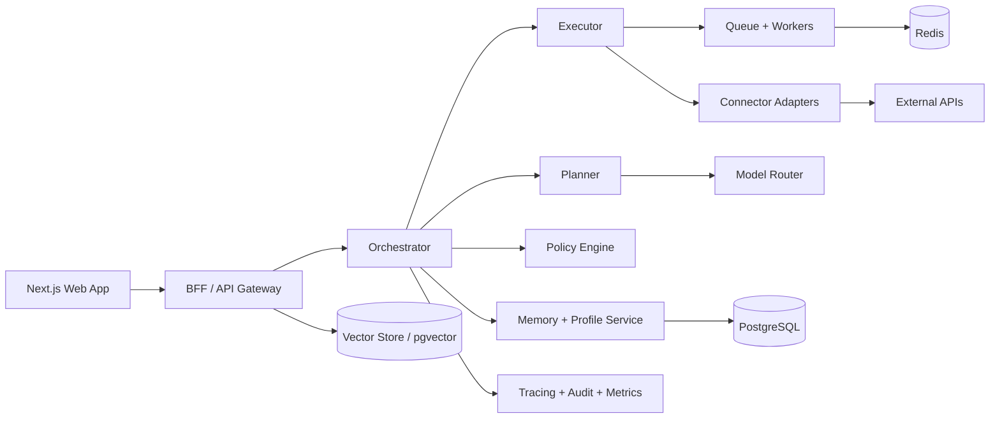

# Personal AI Assistant "Life OS" - Master Architecture and Delivery Roadmap

Last updated: February 13, 2026 (US)

## 1) Executive Summary

This project is a policy-controlled personal AI assistant that can plan and execute tasks across all major life domains while staying safe for non-technical users.

Core product statement:
- "One assistant for life operations" with explicit approvals, reversibility, and transparent audit trails.

Target outcome:
- A hackathon-deliverable MVP that proves cross-domain automation.
- A production-ready architecture that scales to many connectors, many users, and many autonomous workflows.

## 2) Product Goals and Guardrails

### 2.1 Product Goals
- Automate repetitive life/admin work with minimal user effort.
- Convert natural language goals into reliable multi-step execution plans.
- Support non-technical users with plain-language UX and safe defaults.
- Run multiple tasks in parallel when safe.
- Continuously learn user preferences without requiring complex setup.

### 2.2 Hard Guardrails
- No high-risk execution without approval.
- Every external write action is logged and traceable.
- Users can pause all automations instantly.
- Every policy can be overridden only by explicit user confirmation.
- Domain claims must reflect actual connector capability (supported/partial/planned).

## 3) Universal Use-Case Coverage

### 3.1 Domains and Example Automations

| Domain | Example automations |
|---|---|
| Career | Role discovery, CV tailoring, letter drafting, application tracking |
| Finance | Bill reminders, subscription audits, expense classification, invoice drafts |
| Health | Appointment scheduling, medication reminders, wellness plans |
| Family | Shared scheduling, school activity tracking, event reminders |
| Home | Maintenance calendar, vendor scheduling, household checklists |
| Travel | Itinerary creation, reminders, disruption re-planning |
| Communication | Email triage, smart drafting, meeting summaries |
| Shopping/Food | Grocery list planning, reorder suggestions, order drafts |
| Legal/Admin | Renewal alerts, document organization, compliance reminders |
| Creator/Business | Social planning, CRM follow-ups, proposal/invoice generation |

### 3.2 Automation Capability Labels
- `supported`: can execute now with existing connectors.
- `partial`: can draft end-to-end but requires manual submission.
- `planned`: architecture-ready, connector not yet implemented.

## 4) Non-Technical UX Strategy (Mandatory)

### 4.1 Design Rules
- Use plain language, no backend terms in primary UI.
- One primary decision per screen.
- Show "what will happen" before execution.
- Default first-week mode to ask-first approvals.
- Always offer `Undo`, `Pause`, and `Why this?` actions.

### 4.2 First-Run Onboarding (7-10 minutes)
1. Choose priorities: career, health, finance, home, etc.
2. Connect apps with simple permission descriptions.
3. Pick autonomy level:
   - "Ask me for everything"
   - "Ask me for important actions"
   - "Auto-run safe tasks"
4. Set guardrails:
   - Spending cap
   - Posting limits
   - Application batch limits
5. Run first automation template.

### 4.3 Core Screens
- `Home Command Center`: ask anything, view pending items.
- `Approvals`: all actions requiring consent.
- `Timeline`: realtime action feed with step status.
- `Integrations`: connected accounts and scopes.
- `Policies`: safety rules and autonomy settings.
- `Memory`: profile facts/preferences the assistant uses.

## 5) System Architecture



### 5.1 Core Services
- Frontend web app (Next.js, TypeScript).
- API/BFF layer for auth, intake, and orchestration interfaces.
- Orchestrator for planning, step graphing, and execution control.
- Worker pool for async tool actions and retries.
- Connector SDK for standardized OAuth and action handling.
- Observability stack for traces, metrics, and audit.

### 5.2 Execution Topology
- Primary flow: API -> Orchestrator -> Queue -> Workers -> Connector APIs.
- Realtime user feedback via SSE or WebSocket events.
- Idempotency keys on all write actions.
- Compensation paths for partial failures.

## 6) AI/LLM Architecture (Provider-Agnostic)

### 6.1 Agent Roles
- `intent_agent`: transforms user input into structured goal objects.
- `planner_agent`: builds a DAG plan with risk tags and tool candidates.
- `executor_agent`: resolves tool args and executes constrained steps.
- `writer_agent`: produces CVs, letters, messages, summaries.
- `validator_agent`: schema checks, policy checks, and confidence gates.

### 6.2 Model Router Policy
- Route by complexity + latency + risk:
  - `high_reasoning`: strategic planning and conflict resolution.
  - `fast_structured`: extraction and tool argument generation.
  - `longform`: personalized document drafting.
  - `realtime_voice`: speech input/output flows.

### 6.3 API Layer Recommendation
- Use OpenAI `Responses API` as primary agent runtime interface for stateful, tool-using workflows.
- Keep providers abstracted behind internal interfaces:
  - `create_plan(context)`
  - `propose_tool_calls(step)`
  - `generate_artifact(template, data)`
  - `validate_action(action, policy)`

### 6.4 Prompt and Policy Layering
- Global system policy (safety, autonomy, privacy).
- Domain prompts (career, finance, health, etc.).
- Tool schema prompts (strict JSON only).
- Runtime memory context injection (profile, history, user rules).

### 6.5 Hallucination and Safety Controls
- Strict JSON schema validation for all tool calls.
- Confidence thresholds for auto-execution.
- Shadow-mode simulation for new workflows.
- Policy refusal for unsupported actions.

### 6.6 Current Model Selection Matrix (Feb 13, 2026)

| Workload | Primary model class | Notes |
|---|---|---|
| Complex planning and arbitration | Frontier reasoning model (for example GPT-5.2/GPT-5.1 class) | Use higher reasoning effort for multi-constraint planning. |
| Fast tool argument generation | Cost-efficient reasoning model (for example GPT-5 mini/nano class) | Enforce strict JSON schema + retries. |
| High-stakes final drafts | High-quality longform model | Run validator pass before user approval. |
| Low-latency voice interactions | Realtime-capable model | Use streaming and interruption handling. |
| Batch document transforms | Batch-capable lower-cost models | Use background processing for cost control. |

Implementation notes:
- Prefer Responses API as the primary runtime for tool-using, stateful workflows.
- Use streaming for long outputs and interactive timeline updates.
- For heavy reasoning models that can take longer, run in background mode and stream status events.

## 7) Connector Framework

### 7.1 Connector Contract
Every connector implements:
- OAuth lifecycle and token refresh.
- Action schema definitions.
- `dry_run`, `draft`, `execute` modes.
- Retry strategy and rate-limit handling.
- Action-level idempotency.

### 7.2 Connector Priority Roadmap
Phase A (hackathon):
- Google Calendar
- Gmail
- Social scheduler API (or platform API where compliant)
- ATS data source + manual apply package export

Phase B:
- Notion, Slack, Drive, Docs
- Finance aggregators (read-first)
- Food/grocery APIs (approval-first)

Phase C:
- Travel booking APIs
- Home services APIs
- CRM and freelancer workflows

### 7.3 High-Risk Connector Rules
- `execute` requires approval for:
  - public posting
  - external submissions
  - monetary actions
  - legal-sensitive actions

## 8) Data Architecture and Schemas

### 8.1 Storage Layout
- PostgreSQL: users, workflows, policies, approvals, audit records.
- Redis: job queues, locks, ephemeral execution state.
- Object storage: documents, CV versions, generated artifacts.
- Vector index (pgvector): semantic recall over memory/documents.

### 8.2 Minimum Tables
- `users`
- `profiles`
- `preferences`
- `integrations`
- `tasks`
- `workflow_runs`
- `workflow_steps`
- `approvals`
- `tool_calls`
- `artifacts`
- `events`
- `policies`
- `memory_items`

### 8.3 Key Fields by Table
`workflow_runs`
- `id`, `user_id`, `intent`, `state`, `risk_level`, `created_at`, `updated_at`

`workflow_steps`
- `id`, `run_id`, `name`, `depends_on`, `state`, `attempt`, `tool`, `result_ref`

`approvals`
- `id`, `run_id`, `step_id`, `reason`, `status`, `decided_by`, `decided_at`

`tool_calls`
- `id`, `run_id`, `step_id`, `connector`, `action`, `args_json`, `result_json`, `status`

### 8.4 State Machines
Run states:
- `queued -> planning -> waiting_approval -> executing -> completed|failed|canceled`

Step states:
- `pending -> ready -> running -> blocked -> succeeded|failed|skipped`

## 9) API Surface (Representative)

### 9.1 User Task Intake
`POST /api/v1/tasks`

Request:
```json
{
  "intent": "Apply for remote backend jobs and tailor my CV for each one",
  "priority": "high",
  "constraints": {
    "locations": ["Remote", "US"],
    "salary_min": 120000
  }
}
```

### 9.2 Workflow Query
`GET /api/v1/workflows/{id}`
- Returns current step graph, approvals, artifacts, and audit events.

### 9.3 Approval Action
`POST /api/v1/approvals/{id}/decision`

Request:
```json
{
  "decision": "approve",
  "notes": "Submit only top 5 ranked roles"
}
```

### 9.4 Policy Management
- `GET /api/v1/policies`
- `PUT /api/v1/policies/{id}`

### 9.5 Integration Management
- `GET /api/v1/integrations`
- `POST /api/v1/integrations/{provider}/connect`
- `POST /api/v1/integrations/{provider}/disconnect`

## 10) Security and Compliance-by-Design

### 10.1 Security Baseline
- OAuth2/OIDC auth.
- Encrypted tokens at rest with managed KMS.
- Secret rotation and least-privilege scopes.
- RBAC with `owner`, `delegate`, `viewer`.
- Secure logging with redaction.

### 10.2 Action Risk Tiers
- `L0`: read-only, auto-run.
- `L1`: drafts, auto-run + notify.
- `L2`: external writes, approval depending on policy.
- `L3`: payments/legal/public submissions, mandatory approval.

### 10.3 Privacy Requirements
- Data minimization by connector scope.
- User-visible memory records with edit/delete.
- Audit export and account data portability.
- Retention policy controls by user and workspace.

### 10.4 Abuse and Safety Controls
- Prompt injection isolation for tool calls.
- Tool permission boundaries by domain and connector.
- Rate limits and anomaly detection.
- Kill-switch at user and global level.

## 11) Reliability, Testing, and Observability

### 11.1 Reliability Patterns
- Retries with exponential backoff.
- Dead-letter queues for manual triage.
- Idempotent writes and duplicate suppression.
- Circuit breakers around unstable connectors.

### 11.2 Testing Strategy
- Unit tests for policies, state machines, schema validation.
- Contract tests for connector adapters.
- End-to-end tests for critical user journeys.
- Chaos tests for connector outage simulation.

### 11.3 Observability Stack
- Distributed tracing for each workflow run.
- Metrics:
  - task success rate
  - median time-to-first-draft
  - approval conversion
  - connector failure rate
  - rollback frequency
- Structured logs mapped to run/step/tool-call IDs.

## 12) Domain Pack Framework (Scale to "Every Task")

### 12.1 Domain Pack Definition
A Domain Pack includes:
- intent taxonomy
- planner templates
- tool mappings
- policy defaults
- evaluation set
- UI copy bundles

### 12.2 Generic Task DSL
```json
{
  "goal": "string",
  "constraints": {},
  "required_data": [],
  "candidate_tools": [],
  "risk_level": "L0|L1|L2|L3",
  "approval_points": [],
  "success_criteria": []
}
```

### 12.3 Domain Pack Lifecycle
1. Define intents and success criteria.
2. Map connectors and safe action limits.
3. Add policy templates.
4. Add offline evaluation cases.
5. Deploy in shadow mode.
6. Promote when reliability KPIs pass thresholds.

## 13) Detailed Build Roadmap

### 13.1 Track 1: Hackathon (48-72 hours)

### Milestone H0 (0-4h): Setup
- Repo standards, lint/test pipeline, base env configuration.
- DB + Redis provisioning.
- Auth scaffold and session model.

### Milestone H1 (4-12h): Core Flow
- Task intake endpoint.
- Workflow and step state machine.
- Realtime timeline events.
- Approval endpoint and UI.

### Milestone H2 (12-24h): AI + First Connectors
- LLM router abstraction with provider interface.
- Planner prompt and strict JSON plan output.
- Gmail + Calendar connectors (draft-first).
- CV tailoring pipeline with artifact storage.

### Milestone H3 (24-40h): Cross-Domain Proof
- Career workflow (apply package draft).
- Social workflow (draft/schedule).
- Home/finance workflow (reminders/plans).
- Parallel run execution with policy gates.

### Milestone H4 (40-56h): Hardening
- Retry + DLQ + idempotency.
- Telemetry dashboard and run traces.
- Demo dataset and seeded accounts.
- 3 scripted demos with fallback paths.

### Milestone H5 (56-72h): Pitch Packaging
- Final UX copy cleanup for non-technical judges.
- Architecture slide and metrics slide.
- Risk/safety narrative and live demo rehearsal.

### 13.2 Track 2: Productionization (0-90 days)

### Phase P1 (Weeks 1-3)
- Harden orchestrator and policy engine.
- Add top 8 connectors.
- Expand memory and personalization.

### Phase P2 (Weeks 4-6)
- Add domain packs (finance, health, travel, home).
- Add policy recommendation assistant.
- Add incident runbooks and SLO monitoring.

### Phase P3 (Weeks 7-9)
- Security posture upgrade (threat model, pentest prep).
- Compliance documentation and audit exports.
- Multi-tenant workspace support.

### Phase P4 (Weeks 10-12)
- Paid plan controls, quotas, and billing hooks.
- Reliability target >99.5% workflow completion on supported actions.
- Launch candidate gate review.

## 14) Team Operating Model

### 14.1 Recommended Team Split (4 engineers)
- Engineer A: Frontend experience + approvals + policy UI.
- Engineer B: Orchestrator + state machine + queues.
- Engineer C: Connector SDK + OAuth + external API integrations.
- Engineer D: LLM router + prompts + evaluation harness.

### 14.2 Daily Ceremony (Hackathon)
- 15-minute dependency unblock sync every 4-6 hours.
- Hard feature freeze at T-8 hours before judging.
- Last-mile only: bug fixes, demo paths, copy quality.

## 15) Delivery Artifacts Checklist

### 15.1 Must Have by Demo Time
- Running app with natural-language task intake.
- At least 3 domain workflows working end-to-end.
- Approval queue with risk labels.
- Audit timeline and action logs.
- One-click pause all automations.

### 15.2 Strong Differentiators
- Domain pack installer demo.
- Policy templates for non-technical users.
- Parallel workflows with clear conflict handling.
- Reversible actions and clear "undo" semantics.

## 16) KPI Framework

### 16.1 Product KPIs
- Automation completion rate.
- Cross-domain intent coverage.
- Time reclaimed per active user/week.
- User trust score (approved actions / proposed actions).

### 16.2 UX KPIs
- Onboarding completion rate.
- Time-to-first-value.
- Approval comprehension rate.
- Undo success rate.

### 16.3 Platform KPIs
- P95 workflow latency.
- Connector success rate.
- Model/tool schema pass rate.
- Policy violation rate.

## 17) Risk Register

| Risk | Impact | Mitigation |
|---|---|---|
| Connector API instability | High | Adapter retries, fallback draft mode |
| Over-automation errors | High | Conservative defaults + mandatory approvals |
| Prompt/plan drift | Medium | Snapshot prompts + eval suite |
| Long-latency workflows | Medium | Parallel step scheduling + streaming status |
| Misleading capability claims | High | Supported/partial/planned capability matrix |

## 18) Solid Build Standards (Definition of Done)

A feature is done only when:
- product behavior is documented
- risk tier is defined
- approval rules are implemented
- audit events are emitted
- tests exist (unit + integration)
- fallback path is validated
- UX copy is plain-language reviewed

## 19) Immediate Next Build Sequence (Practical)

1. Implement policy engine + approvals first.
2. Add orchestrator DAG with step retries and idempotency.
3. Integrate Gmail + Calendar + one career connector.
4. Ship non-technical onboarding and starter templates.
5. Add observability and demo reliability scripts.

## 20) Source References (Current)

OpenAI official docs:
- [OpenAI API Models](https://platform.openai.com/docs/models)
- [OpenAI API Pricing](https://platform.openai.com/docs/pricing)
- [OpenAI Developers Hub](https://developers.openai.com/)
- [OpenAI Realtime models (example)](https://developers.openai.com/api/docs/models/gpt-4o-realtime-preview)

Other primary docs:
- [Anthropic Pricing and models](https://www.anthropic.com/pricing#anthropic-api)
- [Gemini API model docs](https://ai.google.dev/gemini-api/docs/models)
- [Google Calendar API reference](https://developers.google.com/workspace/calendar/api/v3/reference)
- [Greenhouse Harvest API](https://harvestdocs.greenhouse.io/docs/api-overview)

## 21) Suggested Repository Structure

```text
life-os/
  apps/
    web/                  # Next.js UI
    api/                  # FastAPI or NestJS BFF/API
    worker/               # Async job executors
  packages/
    orchestrator/         # planner/executor/policy engine
    connectors/           # connector SDK + adapters
    llm-router/           # provider abstraction
    shared-types/         # schemas/contracts
    prompt-library/       # system/domain/tool prompts
  infra/
    docker/
    terraform/
    render/
  docs/
    architecture/
    runbooks/
    security/
```

## 22) Implementation Backlog (Detailed)

### 22.1 Epic A: Foundation
- A1: Environment bootstrap scripts.
- A2: Unified config and secret loading.
- A3: Lint, format, typecheck, unit test pipelines.
- A4: CI status checks required on PR.

### 22.2 Epic B: Orchestrator Core
- B1: Intent parser schema and validator.
- B2: DAG plan schema and dependency resolution.
- B3: Step scheduler with parallel branch support.
- B4: Retry/backoff and DLQ handling.
- B5: Compensation hooks for failed writes.

### 22.3 Epic C: Policy and Approval Engine
- C1: Risk classification ruleset.
- C2: Approval state machine.
- C3: User policy templates and overrides.
- C4: Emergency pause and global kill-switch.

### 22.4 Epic D: Connector SDK
- D1: Connector interface contract.
- D2: OAuth token manager + encryption.
- D3: Standard logging + idempotency middleware.
- D4: Calendar adapter.
- D5: Gmail adapter.
- D6: Social draft adapter.
- D7: ATS adapter (read + package export).

### 22.5 Epic E: User Experience
- E1: Command center with natural-language intake.
- E2: Timeline with realtime step events.
- E3: Approvals queue with plain-language diffs.
- E4: Policy settings + onboarding wizard.
- E5: Memory review/edit UI.

### 22.6 Epic F: AI Layer
- F1: Provider router abstraction.
- F2: Planner prompts and tool-call constraints.
- F3: Artifact generation prompts (CV/letter/post).
- F4: Output validators and confidence scoring.
- F5: Eval harness with golden datasets.

### 22.7 Epic G: Platform Hardening
- G1: Tracing and metrics dashboards.
- G2: Audit export endpoints.
- G3: Security headers and abuse controls.
- G4: Load test and capacity baseline.
- G5: Incident runbooks.

## 23) Detailed Acceptance Tests

### 23.1 Functional Acceptance
1. User submits a cross-domain request; system creates a valid workflow DAG.
2. High-risk step is blocked until explicit approval.
3. Approved step executes exactly once (idempotent behavior).
4. Generated artifacts are attached to run history.
5. User can cancel or pause run at any time.

### 23.2 Safety Acceptance
1. Unsupported action requests are refused with explanation.
2. Tool call with invalid schema is blocked and retried safely.
3. Token scope mismatch prevents execution and prompts reconnection.
4. Public post/payment never auto-executes without configured policy and approval.

### 23.3 UX Acceptance (Non-Technical)
1. New user completes onboarding in <=10 minutes.
2. User identifies required action from approval card without training.
3. Undo path is discoverable in <=2 clicks.
4. First successful automation occurs within first session.

## 24) Operating Procedures (Runbooks)

### 24.1 Incident: Connector Outage
1. Circuit-breaker opens for failing connector.
2. New steps downgrade to draft-only mode.
3. Notify users with plain-language status.
4. Queue delayed steps for replay.
5. Publish post-incident summary.

### 24.2 Incident: Model Regression
1. Trigger alert on schema-pass-rate drop.
2. Switch router to fallback model profile.
3. Run automated smoke suite.
4. Freeze risky auto-execution tiers.
5. Roll back prompt/model config version.

### 24.3 Incident: Suspicious Automation
1. Auto-pause affected user/account.
2. Require re-auth for sensitive connectors.
3. Surface audit timeline for review.
4. Restore only after explicit user confirmation.

## 25) Demo Narrative for Judges (High-Confidence)

### Storyline
1. \"I need to manage career tasks, home planning, and social posting today.\"
2. Assistant presents one unified plan with risk labels.
3. User approves only high-impact steps.
4. Assistant executes safe actions in parallel.
5. Timeline shows every action with outcomes and undo options.
6. User pauses all automations and demonstrates full control.

### Proof Points to Emphasize
- Cross-domain automation in one system.
- Non-technical usability and trust.
- Safety-first architecture with transparent controls.
- Clear path from hackathon MVP to production readiness.
